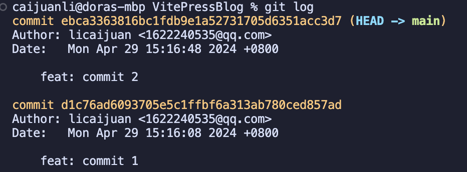
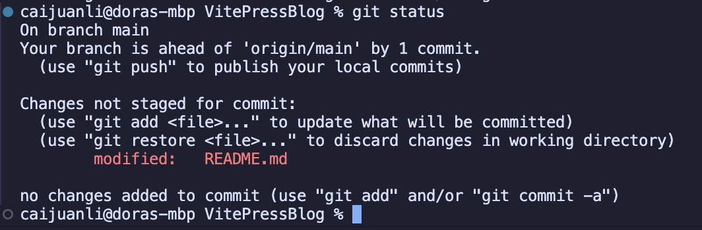

# Git 变更相关

## 版本回退

### `git log`
`git log` 可以查看所有的提交记录。


`git log` 显示从最近到最远的提交日志，根据上图可以看到，最近一次提交是 `commit 3`，最远的是 `commit 1`。
如果认为输出信息太多，可以加上 `--pretty=oneline` 参数，结果如下：


前面一长串类似 `b716697657d31820a05870e5a3d374afed5d506b` 这样的内容是 `commit id`（版本号），这个版本号不是递增，而是一个SHA1计算出来的一个非常大的数字，用十六进制表示。

然后说回版本回退，比如我现在需要将 README.md 从 `commit 3` 回退到上一个版本，也就是 commit 2。
首先我们必须知道当前版本是哪个版本，在 Git 中，用 `HEAD` 表示当前版本，也就是最新那次提交 `commit 3`,这个版本的 `commit id` 就是 `b716697657d31820a05870e5a3d374afed5d506b`。
上一个版本就是 `HEAD^`，上上个版本是 `HEAD^^`，上一百个版本是 `HEAD～100`。

### `git reset`

现在我们可以用 `git reset --hard HEAD^` 命令，回退到上一个版本。
```Git
caijuanli@doras-mbp VitePressBlog % git reset --hard HEAD^
HEAD is now at ebca336 feat: commit 2
```
vscode 中的表现如下图：


可以看到现在 `README.md` 处于一个未推送的状态，`commit 3` 的内容为新增内容。
再来看看 `git log` 命令执行的表现：



可以看到 `commit 3` 这条记录已经消失了～ <br>

Git 的版本回退速度非常快，因为 Git 在内部有个指向当前版本的 `HEAD` 指针。当执行回退动作的时候，Git 仅仅是把指针向前移动一步，然后顺便把工作区的文件更新了，而不是真正的回退到上一个版本。

### `git reflog`
现在，你回退到了某个版本，并且也没有存储该版本的 commit id，又想恢复到新版本的时候，那么你可以用 `git reflog` 命令来查看 `HEAD` 指针指向的版本。


这个命令可以帮我们找到上一个版本的 `commit id`，然后用 `git reset --hard <commit id>` 命令就可以回退到上一个版本了。

## 工作区和暂存区
### 工作区
工作区就是代码存放的目录，包括文件和子目录。
### 版本库
工作区里面有个隐藏的 `.git` 目录，这个不算工作区，而是里面存放了一些版本库信息。<br>
Git 的版本库里存储了很多内容，其中最重要的是称为 `stage` 的暂存区，还有 git 为我们自动创建的第一个分支 `main`，以及指向 `main` 的 `HEAD` 指针。

### 暂存区
暂存区就是保存了代码修改的文件，也就是 `git add` 时添加到暂存区的文件，然后 `git commit` 命令将暂存区的文件提交到当前分支。

实践看看：<br>
我修改一下 `README.md` 的内容，使用 `git status` 命令查看一下状态：


Git 很清晰地告诉我们，`README.md` 已经被修改了，它的状态是 `modified`。<br>

ok，接下来我就用 `git add` 命令把文件添加到暂存区，然后再来看看状态。


这样就非常明显地看到，`README.md` 已经被添加到了暂存区。颜色也不一样了。<br>
## 管理修改

> 为什么 Git 比其他版本控制系统设计得优秀？<br>
> 因为 Git 跟踪并管理的是修改，而非文件。

简单来说就是，Git 只提交世纪修改的部分，因此占用的空间比较小。<br>
但这里还有个命令需要了解一下。
### `git diff`


我在 README.md 文件中新增了一行，内容为 `## commit 4`。

## 撤销修改
### `git checkout -- <filename>`
`git checkout -- README.md` 的意思是，把文件 `README.md` 的在工作区的修改全都撤销掉。这里有两种情况：
  - `README.md` 自修改后还没有添加到暂存区，那么 `git checkout -- README.md` 就直接撤销到和版本库一样的状态；
  - `README.md` 已经被添加到暂存区了。 那么 `git checkout -- README.md` 就撤销到暂存区的状态。<br>
**总之，就是让这个文件回到最后一次 `git commit` 或 `git add` 命令时的状态。**

## 删除修改
### `git rm <filename>`
直接删除 `README.md` 文件，就是删除了工作区上的文件。