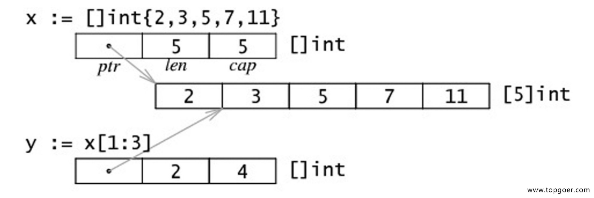

# 切片

## 切片是什么
1. 切片是数组的一个引用，因此切片是引用类型。但自身是结构体，值拷贝传递；
2. 切片的长度可以改变，因此切片是一个可变的数组；
3. 切片遍历方式和数组一样，可以用 len() 求长度。表示可用元素数量，读写操作不能超过该限制；
4. cap 可以求出 slice 最大扩张容量，不能超出数组限制。0 <= len(slice) <= len(array)。其中 array 是 slice 引用的数组；
5. 切片的定义： var 变量名 []类型，例如：var s []int，表示一个存放 int 类型元素的切片。
6. 如果 slice == nil，那么 len、cap 结果都等于 0

## 创建切片的方式
```go
package main  

import "fmt"

func main() {
  // 1. 声明切片
  var s1 []int
  if s1 == nil {
    fmt.Println("是空") 
  } else {
    fmt.Println("不是空")
  }

  // 2. :=
  s2 := []int{}

  // 3. make
  var s3 []int = make([]int, 0)
  fmt.Println(s1, s2, s3)

  // 4. 初始化赋值
  var s4 []int = make([]int, 0, 0)
  fmt.Println(s4)
  s5 := []int{1, 2, 3}
  fmt.Println(s5)

  // 5. 从数组切片
  arr := [5]int{1, 2, 3, 4, 5}
  var s6 []int

  // 前包后不包
  s6 = arr[1:4]
  fmt.Println(s6)
}
```

## 切片初始化
```go
// 全局
var arr = [...]int{0, 1, 2, 3, 4, 5, 6, 7, 8, 9}
var slice0 []int = arr[start:end]
var slice1 []int = arr[:end]
var slice2 []int = arr[start:]
var slice3 []int = arr[:]
var slice4 = arr[:len(arr)-1] // 去掉切片的最后一个元素

// 局部
arr2 := [...]int{9, 8, 7, 6, 5, 4, 3, 2, 1, 0}
slice5 := arr[start:end]
slice6 := arr[:end]
slice7 := arr[start:]
slice8 := arr[:]
slice9 := arr[:len(arr)-1]
```

| 操作 | 含义 |
| --- | --- |
| s[n] | 切片 s 中索引位置为 n 的项 |
| s[:] | 从切片 s 的索引位置 0 到 len(s) - 1 的所有项 |
| s[low:] | 从切片 s 的索引位置 low 到 len(s) - 1 的所有项 |
| s[:high] | 从切片 s 的索引位置 0 到 high 处所得的切片，len = high |
| s[low:high] | 从切片 s 的索引位置 low 到 high 处所得的切片，len = high - low |
| s[low:high:max] | 从切片 s 的索引位置 low 到 high 处所得的切片，len = high - low, cap = max - low |
| len(s) | 切片 s 的长度，总是 <= cap(s) |
| cap(s) | 切片 s 的容量，总是 >= len(s) |

## 通过 make 来创建切片

```go
var slice []type = make([]type, len)
slice := make([]type, len)
slice := make([]type, len, cap)
```

## 用 append 内置函数操作切片（切片追加）
```go
package main

import (
    "fmt"
)

func main() {
  var a = []int{1, 2, 3}
  fmt.Printf("slice a : %v\n", a)
  var b = []int{4, 5, 6}
  fmt.Printf("slice b : %v\n", b)
  c := append(a, b...)
  fmt.Printf("slice c : %v\n", c)
  d := append(c, 7)
  fmt.Printf("slice d : %v\n", d)
  e := append(d, 8, 9, 10)
  fmt.Printf("slice e : %v\n", e)
}
```
输出结果
```go
slice a : [1 2 3]
slice b : [4 5 6]
slice c : [1 2 3 4 5 6]
slice d : [1 2 3 4 5 6 7]
slice e : [1 2 3 4 5 6 7 8 9 10]
```

## 超出原 slice.cap 限制，就会重新分配底层数组，即便原数组并未填满

```go
package main
import (
    "fmt"
)

func main() {
  data := [...]int{1, 2, 3, 4, 10:0}
  s := data[:2:3]
   
  s = append(s, 100, 200)

  fmt.Println(s, data)

  fmt.Println(&s[0], &data[0])
}
```
输出结果
```go
[0 1 100 200] [0 1 2 3 4 0 0 0 0 0 0]
0xc4200160f0 0xc420070060
```
> 从输出结果中看出，append 后的 s 重新分配了底层数组，并复制数据。如果只追加一个值，则不会超过 s.cap 的限制，也就不会重新分配。通常以 2 倍容量重新分配底层数组。在大批量添加数据时，建议一次性分配足够大的空间，以减少内存分配和数据复制的开销。或初始化足够长的 len 属性，改用索引号进行操作。及时释放不再使用的 slice 对象，避免持有过期数组，造成 GC 无法回收。

## slice 中 cap 重新分配规律

```go
package main

import (
  "fmt"
)

func main() {
  s := make([]int, 0, 1)
  c := cap(s)

  for i := 0; i < 50; i++ {
    s = append(s, i)
    if n := cap(s); n > c {
      fmt.Printf("cap: %d -> %d\n", c, n)
      c = n
    }
  }
}
```
输出结果：
```go
cap: 1 -> 2
cap: 2 -> 4
cap: 4 -> 8
cap: 8 -> 16
cap: 16 -> 32
cap: 32 -> 64
```

## 切片拷贝
```go
package main

import (
  "fmt"
)

func main() {
  s1 := []int{1, 2, 3, 4, 5}
  fmt.Printf("slice s1 : %v\n", s1)
  s2 := make([]int, 10)
  fmt.Printf("slice s2 : %v\n", s2)
  copy(s2, s1)
  fmt.Printf("copied slice s1 : %v\n", s1)
  fmt.Printf("copied slice s2 : %v\n", s2)
  s3 := []int{1, 2, 3}
  fmt.Printf("slice s3 : %v\n", s3)
  s3 = append(s3, s2...)
  fmt.Printf("appended slice s3 : %v\n", s3)
  s3 = append(s3, 4, 5, 6)
  fmt.Printf("last slice s3 : %v\n", s3)
}
```
输出结果:
```go
slice s1 : [1 2 3 4 5]
slice s2 : [0 0 0 0 0 0 0 0 0 0]
copied slice s1 : [1 2 3 4 5]
copied slice s2 : [1 2 3 4 5 0 0 0 0 0]
slice s3 : [1 2 3]
appended slice s3 : [1 2 3 1 2 3 4 5 0 0 0 0 0]
last slice s3 : [1 2 3 1 2 3 4 5 0 0 0 0 0 4 5 6]
```
> copy ：函数 copy 在两个 slice 间复制数据，复制长度以 len 小的为准。两个 slice 可指向同一底层数组，允许元素区间重叠。

## slice 遍历

```go
package main

import (
  "fmt"
)

func main() {
  data := [...]int{0, 1, 2, 3, 4, 5, 6, 7, 8, 9}
  slice := data[:]
  for index, value := range slice {
    fmt.Printf("inde : %v , value : %v\n", index, value)
  }
}
```
输出结果：
```go
inde : 0 , value : 0
inde : 1 , value : 1
inde : 2 , value : 2
inde : 3 , value : 3
inde : 4 , value : 4
inde : 5 , value : 5
inde : 6 , value : 6
inde : 7 , value : 7
inde : 8 , value : 8
inde : 9 , value : 9
```

## 切片 resize（调整大小）
```go
package main

import (
  "fmt"
)

func main() {
  var a = []int{1, 3, 4, 5}
  fmt.Printf("slice a : %v , len(a) : %v\n", a, len(a))
  b := a[1:2]
  fmt.Printf("slice b : %v , len(b) : %v\n", b, len(b))
  c := b[0:3]
  fmt.Printf("slice c : %v , len(c) : %v\n", c, len(c)) 
}
```
输出结果：
```go
slice a : [1 3 4 5] , len(a) : 4
slice b : [3] , len(b) : 1
slice c : [3 4 5] , len(c) : 3
```

## 数组和切片的内存布局



## 字符串和切片
string 底层就是一个 byte 的数组，因此也可以进行切片操作。

```go
package main

import (
  "fmt"
)

func main() {
  str := "hello world"
  s1 := str[0:5]
  fmt.Println(s1)

  s2 := str[6:]
  fmt.Println(s2)
}
```
输出结果：
```go
hello
world
```

string 本身是不可变的，因此需要改变 string 中字符，需要如下操作：

```go
package main

import (
    "fmt"
)

func main() {
  str := "Hello world"
  s := []byte(str) //中文字符需要用[]rune(str)
  s[6] = 'G'
  s = s[:8]
  s = append(s, '!')
  str = string(s)
  fmt.Println(str)
}
```

**golang  slice 中冒号的理解：**<br>
- 常规slice , data[6:8]，从第6位到第8位（返回6， 7），长度len为2， 最大可扩充长度cap为4（6-9）<br>

- 另一种写法： data[:6:8] 每个数字前都有个冒号， slice内容为data从0到第6位，长度len为6，最大扩充项cap设置为8 <br>

- a[x:y:z] 切片内容 [x:y] 切片长度: y-x 切片容量:z-x <br>