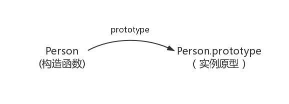
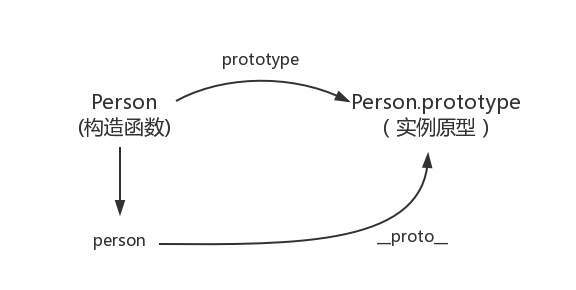
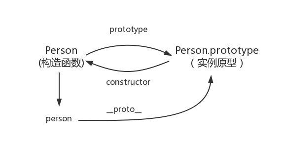
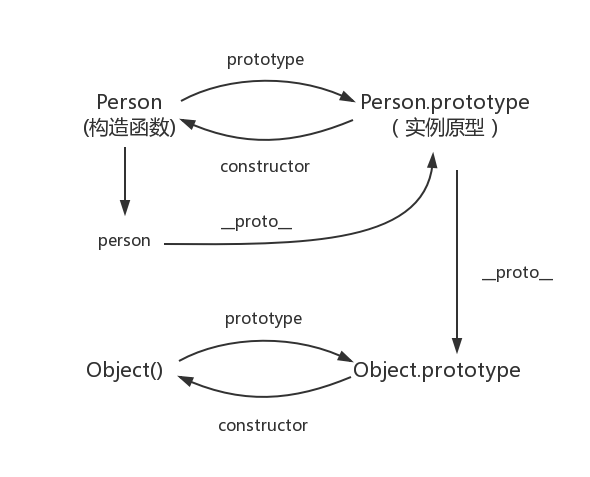
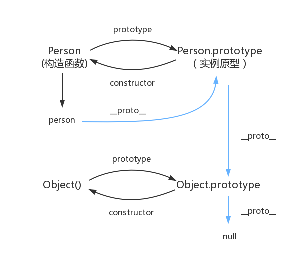

# 从原型到原型链

## 构造函数创建对象

```js
function Person() {}
const p = new Person();
p.name = 'dora';
```
在这个例子中，Person 就是一个构造函数，使用 new 创建了一个实例对象 person;

## prototype
每个函数都有一个 prototype 属性，用于指定该函数的原型对象。
比如：

```js
function Person() {}
// 虽然写在注释里，但是你要注意：
// prototype是函数才会有的属性
Person.prototype.name = 'Kevin';
var person1 = new Person();
var person2 = new Person();
console.log(person1.name) // Kevin
console.log(person2.name) // Kevin
```

>函数的 prototype 属性指向一个对象，这个对象正是调用该构造函数而创建的实例的原型

### 原型是什么
>每一个JavaScript对象(null除外)在创建的时候就会与之关联另一个对象，这个对象就是我们所说的原型，每一个对象都会从原型"继承"属性。<br>

偷一张网上大佬的图：


## `__proto__`
这是每个 `Javascript` 对象（除了 `null`）都有的属性，这个属性指向该对象的原型。<br>
再偷一张：


## constructor
既然构造函数和实例对象都可以指向原型，那么原型是否有属性指向构造函数或者实例呢？<br>

指向实例没有，因为一个构造函数可以生成多个实例。<br>

每个原型都有一个 constructor 属性指向关联的构造函数。

```js
function Person() {}
console.log(Person === Person.prototype.constructor); // true
```



## 实例与原型
当读取实例的属性时，如果找不到，就会查找与对象关联的原型中的属性，如果还找不到，就去找原型的原型，一直找到最顶层为止。<br>

举个栗子：

```js
function Person() {}

Person.prototype.name = 'Kevin';
var person = new Person();
person.name = 'Daisy';
console.log(person.name) // Daisy

delete person.name;
console.log(person.name) // Kevin
```

在这个例子中，我们给实例对象 `person` 添加了一个 `name` 属性，当我们打印 `person.name` 时，结果自然为 `Daisy`；<br>
但是删除了 `name` 属性后，再去读取这个 `name` 值，从 `person` 对象中找不到 `name` 属性，就会从 `person` 的原型，也就是 `person.__proto__`，也就是 `Person.prototype` 中去找。结果为 `Kevin`。<br>
但万一还是没有找到，原型的原型又是什么呢？

## 原型的原型
原型也是一个对象，既然是对象，就可以以最原始的方式创建它，比如：

```js
var obj = new Object();
obj.name = 'Kevin'
console.log(obj.name) // Kevin
```
其实原型对象就是通过 `Object` 构造函数生成的。


## 原型链
`Object` 的原型是什么呢？答案是 `null`，因为它没有任何原型。<br>
`null` 是什么？
>`null` 表示没有对象，即此处不该有值。

查找属性的过程中，如果没有找到，就会一直向上查找原型，直到找到 `null` 为止。
下图中蓝色的线就是原型链：


